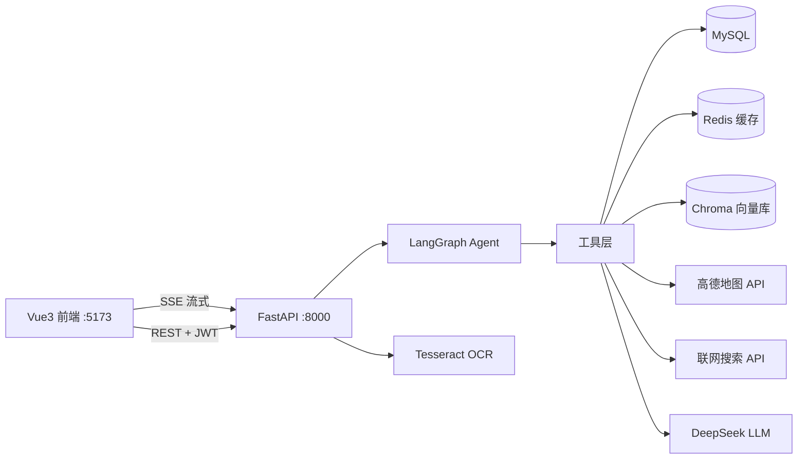

# 🐾 宠物健康管家（Pet Health Manager）

一个具备**闭环 AI Agent 能力**的宠物健康管理应用：AI 助手可自主拆解任务、调用工具（RAG 检索、宠物档案、行为日志、地图、联网搜索）、反思结果并持续调整直到完成任务。支持流式输出、会话记忆、OCR 图片识别。

> 面试定位：全栈 AI 应用 —— FastAPI 异步后端 + Vue3 前端 + LangGraph Agent + RAG + MCP 工具协议 + Redis 缓存

## ✨ 核心特性

| 模块 | 能力 |
|---|---|
| 🤖 AI Agent | LangGraph 闭环（思考→工具→观察→反思→重试），checkpointer 多会话记忆，SSE 流式输出，长对话自动摘要 |
| 🔍 RAG | 向量（BGE）+ BM25 + RRF 多路召回，日期过滤（过期文档检索不到），MD5/MinHash 去重，OCR 数据清洗，返回带 **chunk 索引的证据** |
| 🛠 工具 | 5 个 Agent 工具：宠物档案、行为日志分析、附近宠物医院（高德）、联网搜索（博查）、RAG 知识检索；支持 MCP 协议 |
| 📷 OCR | Tesseract 中文识别，图片内容可直接发给 AI 分析 |
| ⚡ 后端工程 | FastAPI 全异步、MySQL 连接池、Redis 缓存（熔断降级）、JWT 认证、接口全鉴权 |
| 📱 前端 | Vue3 + Vite，登录/会话管理/流式对话/宠物管理 |

## 🏗 架构



## 🛠 技术栈

- **后端**：Python 3.13、FastAPI、LangGraph、LangChain、aiomysql、Redis、Chroma、JWT
- **前端**：Vue3、Vite、Axios
- **AI**：DeepSeek API、BGE-small-zh 向量模型、BM25（jieba 分词）
- **部署**：Git、GitHub、Windows 一键启动脚本

## 📁 目录结构

```
PythonProject/
├── backend/                # 后端包
│   ├── main.py             # FastAPI 入口：app + 生命周期 + 全部路由
│   ├── config.py           # 全局配置：环境变量 / LLM / OCR
│   ├── db.py               # 数据层：MySQL 连接池 + Redis 缓存（熔断）
│   ├── auth.py             # 安全层：密码哈希 + JWT
│   ├── rag.py              # 检索层：加载/去重/切分/多路召回/重排序/证据
│   └── agent.py            # 智能层：5 个工具 + LangGraph Agent 构建
├── mcp_server.py           # MCP 协议服务器
├── eval_rag.py             # RAG 评测脚本（recall / precision）
├── tests/                  # pytest 单测（JWT/宠物 CRUD/RAG 召回）
├── pet-frontend/           # Vue3 前端
├── data/                   # RAG 知识库（txt/pdf/docx/图片）
├── resources/tessdata/     # OCR 语言包
├── start_web.bat           # 一键启动（等待后端就绪后开浏览器）
├── start_redis.bat         # Redis 启动
└── .gitignore
```

## 🚀 快速开始

### 依赖
- Python 3.13 + 虚拟环境、Node.js 22
- MySQL（建库 `pet`）、Redis（6379）
- Tesseract-OCR（含中文语言包）

### 环境变量（.env 或系统变量）
```
DEEPSEEK_API_KEY=你的密钥
AMAP_KEY=你的高德地图密钥
WEB_SEARCH_KEY=你的联网搜索密钥
DB_PASSWORD=数据库密码
SECRET_KEY=随机长字符串（JWT 签名）
```

### 启动
```bash
# 方式一：Windows 双击 start_web.bat（自动等后端就绪再开浏览器）
# 方式二：手动
cd PythonProject
.venv\Scripts\python.exe -m uvicorn backend:app --host 127.0.0.1 --port 8000
cd pet-frontend && npm run dev
```
访问 http://127.0.0.1:5173

## 📊 评测数据

```bash
.venv\Scripts\python.exe eval_rag.py            # RAG 召回率 + 精确率（零 LLM 成本）
.venv\Scripts\python.exe eval_rag.py --full     # 加测端到端回答命中率
.venv\Scripts\python.exe -m pytest tests/ -q    # 运行全部单测
```

| 指标 | 结果 |
|---|---|
| RAG 召回率 recall@3 | **100%**（5/5） |
| RAG 精确率 precision@3 | 53% |
| API 接口测试 | 25/25 通过 |
| 高并发测试（50 并发） | 100% 成功 |
| Agent 闭环测试（LLM 实测） | 8/8 达标 |

## 🔒 安全说明

- 所有密钥通过环境变量注入，**代码仓库零硬编码**
- 全部业务接口 JWT 鉴权，未登录无法调用任何 AI/数据接口
- 数据库密码、JWT 密钥均不落入版本库

## 📝 License

MIT
